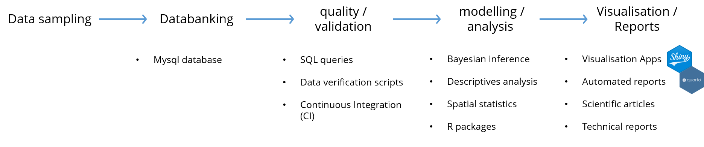
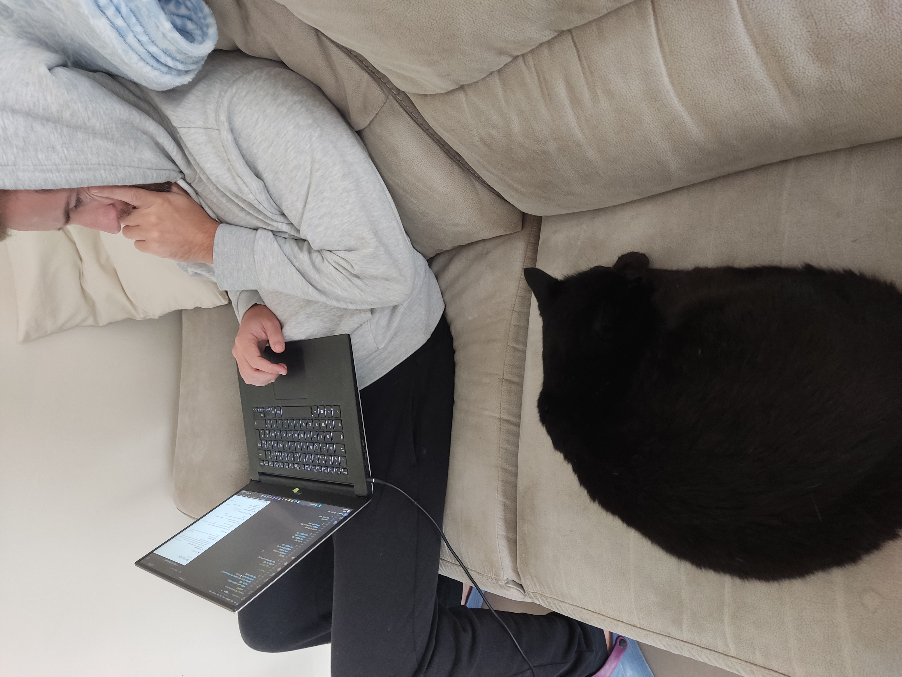
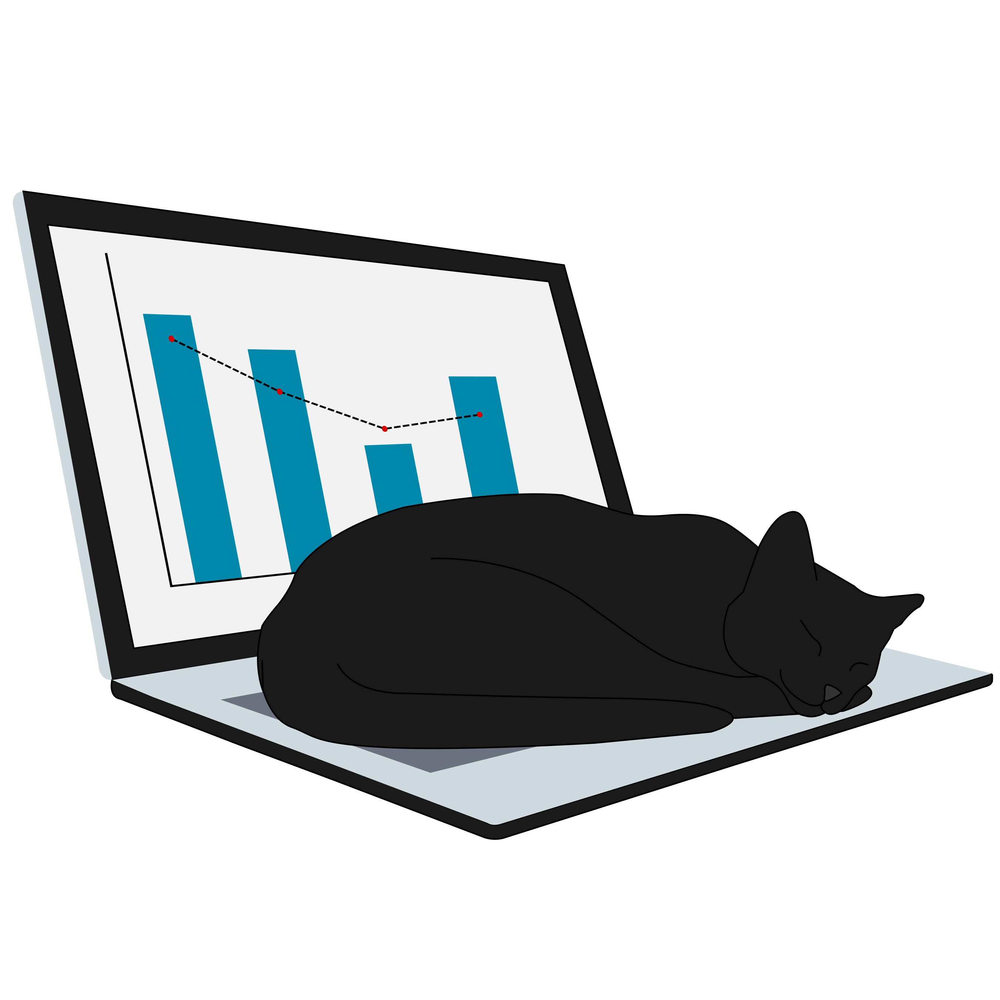

## Who am I ?
I am a data analyst specialising in data manipulation, data visualisation and scientific reproducibility. I mainly use R and SQL to transform complex data into clear and actionable insights.

<h2 style="margin-top:8rem;"> Background </h2>
With a background in marine ecology, I gradually developed a career focused on statistical analysis and the automation of data processing. The need for reproducibility, visualisation and reporting led me to specialise in data tools and analytical workflows.

<a href="/CV" class="btn-primary">Resume</a>
<!-- <a href="/publication" class="btn-secondary">Publications</a> -->

<h2 style="margin-top:8rem;"> Working phylosophy </h2>
I place particular emphasis on the reproducibility of analyses and the readability of code. I aim to build tools that are simple, well-documented and easy to maintain. Here is the workflow I follow to carry out the analyses I undertake :

<h2 style="margin-top:8rem;"> About the logo </h2>

:::{.home-about style="padding: 0;"}

:::{.home-about-image}

:::

:::{.home-about-presentation}

The logo of this website is inspired by a black cat (named Twix) from my neighborhood
who used to spend most of his time next to my "desk" while I was working from home.

Over time, he unofficially became the manager of my freelance activity —
carefully supervising meetings, debugging sessions, and coffee breaks.

The logo is a small tribute to that very serious coworker.

:::

:::

