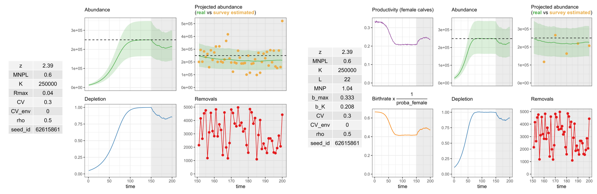
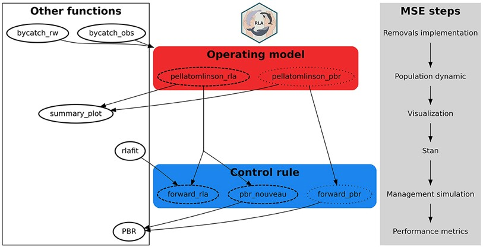

### RLA in 2 words

RLA is an R package that aims to estimate removal limit of marine mammals species. Limits are estimated thanks to a __control rule__ which is linked to a __biological model__ of the species. The control rule correspond to an equation/algorithm that gives the limit of individuals which can be removed from the population. The coupled model has a chronological dimension to project future management scenarios of removal mitigation (For example, let's say we decrease fishing effort which is a major threat for our population of marine mammal, what could be the resulting situation in 50 years ?).

### MSE : Management Strategy Evaluation

The RLA package is a useful tool to simulate management scenarios projecting different possible situations. However it can be difficult to estimate robustness of different tested scenarios and estimate decision thresholds. One way to integrate these variables is to model using a __MSE__ framework. The MSE framework is a simulation environment which will test every possible scenarios with different condition of simulation. To illustrate, let's say we have a population of marine mammal, one scenario is to let the situation run without changing anything and another scenario is to reduce the cause of removal by 50%. However the data on which the cause of removal is estimated is very wobbly, and we suspect that data can be higher that records. Knowing that, with the MSE framework it is possible to integrate this situation of uncertain data and simulate adding a scenario with records underestimated by 2 or 1.5.

### What's inside {RLA} ?

Two functions allow to simulate a population, using a Pella-tomlinson model :
- `pellatomlinson_agg()` (agg for aggregated) which correspond to a Pella-tomlinson model age-aggregated used with PBR controle rule
- `pellatomlison_dis()` (dis for disaggregated) which is a Pella-tomlinson model defined by age used with RLA control rule, or "PBR_nouveau" which is a PBR using age defined operating-model
  
Operating model can be summarized via graphics, using `summary_plot()` : 

Once parameters on operating model are tuned, functions using control rules can be used : 

- `forward_pbr()` PBR control rule on age aggredated pella-tomlinson operating model
- `forward_rla()` RLA control rule age disaggrated pella-tomlinson model

Furthermore, several functions exists orbiting around the previous ones allowing to ease tuning of parameters. For more details on the use of {RLA} package see docuentation on the [gitlab repository](https://gitlab.univ-lr.fr/pelaverse/rla)