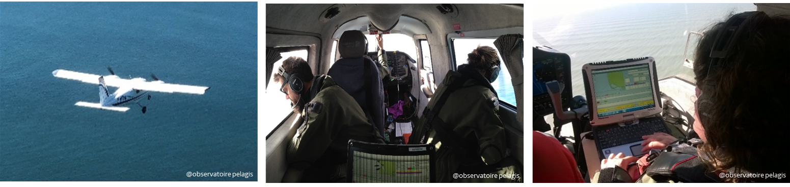
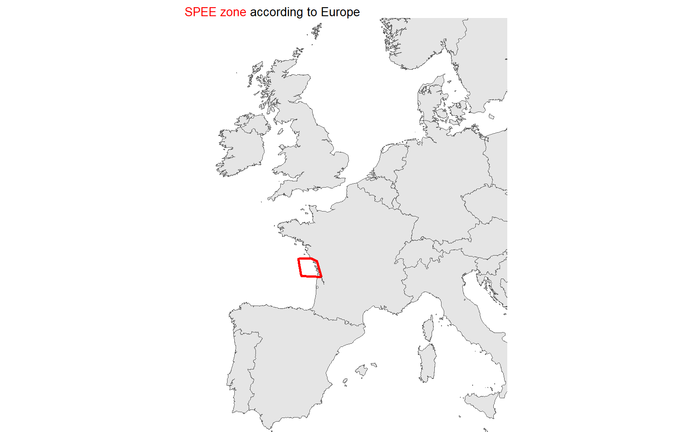
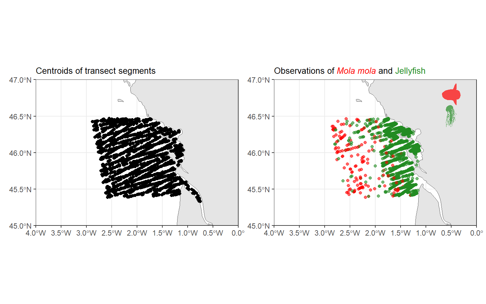
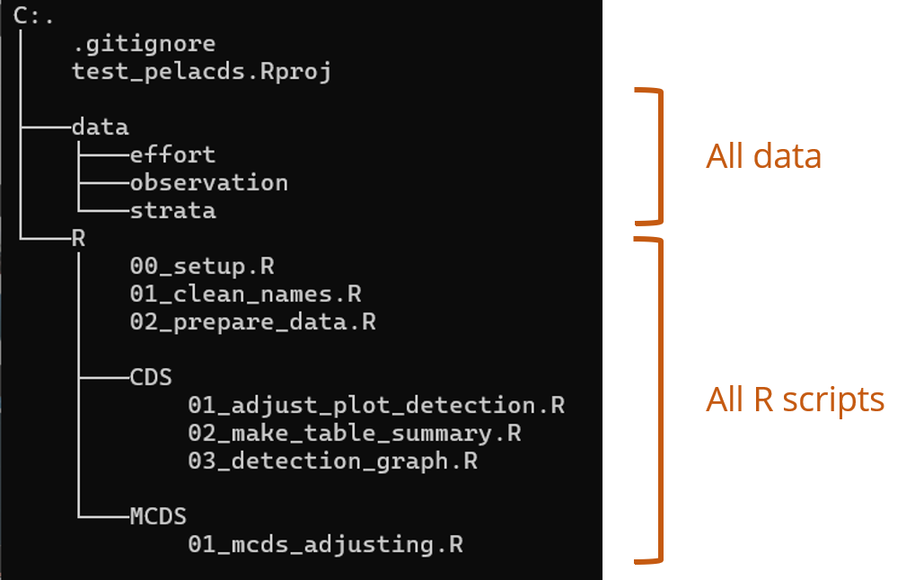
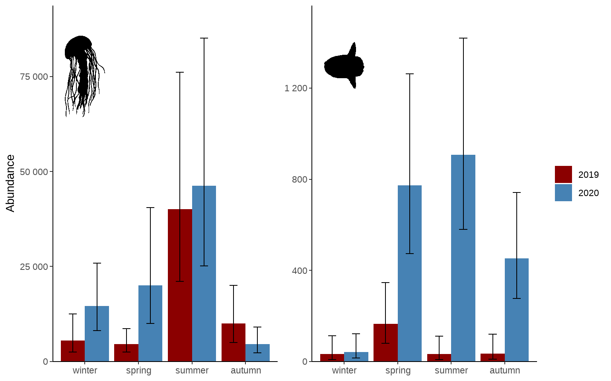

## What is pelaverse ?

**"pelaverse"** is a group on La Rochelle university gitlab that gather a bunch of packages created by [pelagis](https://www.observatoire-pelagis.cnrs.fr/). Its name is a reference to [**tidyverse**](https://www.tidyverse.org/), *"a collection of packages"* helping to manipulate and visualize data. In the same spirit as tidyverse, pelaverse aims at gathering R packages used/created by pelagis for the use of pelagis and collaborators.

## Aerial observation surveys

One of the main activity of pelagis lab is to survey marine megafauna in french oceans. To do so, aerial monitoring is carried out following a transect scheme (see figure above). From these observations along the transect it is possible to extrapolate abundance of each species/taxa using [Distance sampling](https://distancesampling.org/) modelling.

> We developed a [shiny app](https://pelabox.univ-lr.fr/pelagis/PelaObs/) to visualize observation campaign, it is possible to filter on date, species, area, ...

<figure>

<figcaption aria-hidden="true">Aerial transect of marine megafauna. Plane flying over the ocean (left). Observer spotting animals on the water (middle). Sightings recorded in the field computer (right)</figcaption>
</figure>

<!--  -->

A group of packages are dedicated to the analysis of aerial observation survey :
- {pelaCDS} : package for **C**onventionnal **D**istance **S**ampling analysis of observation data
- {pelaDSM} : package to adjust **D**ensity **S**urface **M**odels
- {pelaKrig} : package to adjust **Krig**ing models

## An example with pelaCDS

We will have a look of what {pelaCDS}, a package of the pelaverse, have to offer.

1.  Get pelaCDS package
2.  Data used in this example
3.  Build a repository
4.  Analyze data

<!-- end list -->

### 1. Get pelaCDS package

I assume you have installed R on your machine and a IDE of your convenience.
To download {pelaCDS} just run :

<details class="code-fold">
<summary>Code</summary>

``` r
install.packages("remotes")
remotes::install_gitlab(
  host = "https://gitlab.univ-lr.fr/",
  repo = "pelaverse/pelacds"
)
```

</details>

### 2. Data used in this example

For this example, we will use the data of the pelaCDS package **`SPEE_data`**. This data contains a list of multiple data, we will keep only `effort_raw` and `obs_with_sp` corresponding to the effort transect of SPEE campaign and associated observations for 2 groups :

-   *Mola mola* the sunfish with code `MOLMOL` in `species` column of `obs_with_sp`
-   jellyfish with code `JELLY` in `species` column `obs_with_sp`

<details class="code-fold">
<summary>Code</summary>

``` r
library(pelaCDS)
library(ggplot2)       # graphics
library(sf)            # handle sf object 
library(rnaturalearth) # coastlines
library(ggtext)        # colour in title
library(patchwork)     # multiple graph layout
data(SPEE_data)

fr <- ne_countries(country = "France", scale = 10)
europe <- ne_countries(continent = "europe",scale = 10)

effort <- SPEE_data$effort_raw
obs <- SPEE_data$obs_with_sp

title_size <- 10

map_zone <- ggplot() +
    geom_sf(data = europe) +
    geom_sf(
        data = effort %>% st_union() %>% st_convex_hull(),
        colour = "red",
        linewidth = 1,
        fill = NA
    ) +
    coord_sf(
        xlim = c(-12,15),
        ylim = c(37,60)
    ) + 
    labs(title = "<span style='color: red;'>SPEE zone</span> according to Europe") +
    theme_void() +
    theme(plot.title = element_markdown(hjust = 0, size = title_size))

map_zone
```

</details>



<details class="code-fold">
<summary>Code</summary>

``` r
library(rphylopic)
mola_pic <- get_phylopic(uuid = "3e072993-d4fd-440a-8929-07bb19391542")
jelly_pic <- get_phylopic(uuid = "6f25228d-34f6-4a84-b52d-ce03d3fcd152")
map_effort <- ggplot() +
    geom_sf(data = fr) +
    geom_sf(data = effort) +
    coord_sf(
        expand = F,
        xlim = c(-4, 0),
        ylim = c(45, 47)
    ) +
    labs(title = "Centroids of transect segments") +
    theme_bw() +
    theme(plot.title = element_markdown(hjust = 0, size = title_size))

map_obs <- ggplot() +
    geom_sf(data = fr) +
    geom_sf(
        data = obs,
        aes(colour = species),
        alpha = 0.6,
        show.legend = F
    ) +
    geom_phylopic(
        data = data.frame(
            x = -0.5,
            y = 46.8
        ), aes(x = x, y = y),
        img = mola_pic,
        fill = "red",
        alpha = 0.7,
        height = 0.3
    ) +
    geom_phylopic(
        data = data.frame(
            x = -0.5,
            y = 46.5
        ), aes(x = x, y = y),
        img = jelly_pic,
        fill = "forestgreen",
        alpha = 0.7,
        height = 0.3
    ) +
    coord_sf(
        expand = F,
        xlim = c(-4, 0),
        ylim = c(45, 47)
    ) +
    scale_colour_manual(values = c("MOLMOL" = "red", "JELLY" = "forestgreen")) +
    labs(title = "Observations of <span style='color: red;' >*Mola mola*</span> and <span style='color: forestgreen;' >Jellyfish</span>") +
    theme_bw() +
    theme(
        plot.title = element_markdown(hjust = 0, size = title_size),
        axis.title = element_blank()
    )


map_effort | map_obs 
```

</details>



### 3. Create a repository with all scripts prefilled

<details class="code-fold">
<summary>Code</summary>

``` r
library(pelaCDS)
create_cds_proj("c:/users/computer/Documents/my_cds_analysis")
```

</details>

By running the previous lines of code, you will create a repository **my_cds_analysis** with this tree :

<!-- {#fig-tree width='100px'} -->



Data have to be in **data** sub-directory (In our example, effort and observation are already in pelaCDS package).

#### Modification of prefilled scripts

Scripts have to be adapted for each case study.

### 4. Analysing data

After dropping data at the good spot in the repository, adapting scripts for your case study and launched scripts in the correct order, you can visualise the resulting adjustment of your model

<details class="code-fold">
<summary>Code</summary>

``` r
library(tidyverse)
library(readxl)     # open excel files
library(rphylopic)  # species silhouette
library(showtext)   # Modify font

showtext.auto()
franklin <- google_fonts("Libre Franklin")

tab <- readxl::read_excel("data/table_summary.xlsx")

mola_pic <- get_phylopic(uuid = "3e072993-d4fd-440a-8929-07bb19391542")
jelly_pic <- get_phylopic(uuid = "6f25228d-34f6-4a84-b52d-ce03d3fcd152")

pic_data <- tibble(
  x = c(1,1),
  y = c(1300,75000),
  height = c(200,10000),
  taxon = c("MOLMOL","JELLY"),
  img = c(mola_pic,jelly_pic)
)

tab <- tab %>% 
  separate(region,c("survey","cycle","sub_region","strate","session")) %>% 
  rename(N = animal_abundance,
         N_min = `abon_min_(IC95%)`,
         N_max = `abon_max_(IC95%)`) %>% 
  mutate(season = case_when(
    session %in% c("1","5") ~ "winter",
    session %in% c("2","6") ~ "spring",
    session %in% c("3","7") ~ "summer",
    session %in% c("4","8") ~ "autumn",
  ) %>% factor(levels = c("winter","spring","summer","autumn")),
  year = as.factor(ifelse(cycle == 1,2019,2020)))

tab %>% 
  ggplot(aes(x = season, y = N, fill = year)) +
  geom_bar(stat = "identity", position = position_dodge(width = 0.9)) +
  geom_errorbar(aes(ymin = N_min, ymax = N_max), 
                position = position_dodge(width = 0.9),
                width = 0.3,
                ) +
  geom_phylopic(data = pic_data,
                aes(img = img, 
                    x= x, 
                    y= y,
                    ),
                width = 0.75,
                inherit.aes = F) +
  labs(y = "Abundance") +
  scale_fill_manual(values = c("2019" = "darkred", "2020" = "steelblue")) +
  scale_y_continuous(expand = expansion(mult = c(0,0.1))) +
  facet_wrap(vars(taxon),scales = "free_y") +
  theme_classic() +
  theme(axis.title.x = element_blank(),
        legend.title = element_blank(),
        strip.background = element_blank(),
        strip.text = element_blank(),
        text = element_text(family = franklin, size = 22))
```

</details>


